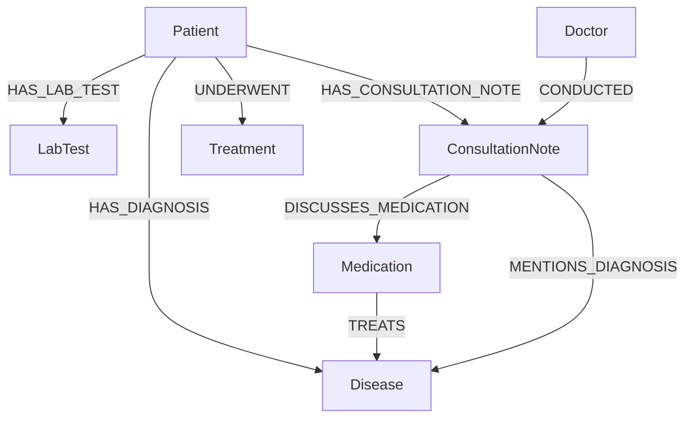

# MediGraph

**An intelligent clinical knowledge graph and AI medical scribe platform that transcribes patient consultations into structured clinical records, grounded in a real-time Neo4j AuraDB healthcare knowledge graph.**

[](https://react.dev/)
[](https://flask.palletsprojects.com/)
[](https://neo4j.com/cloud/platform/aura-graph-database/)
[-f55036.svg)](https://groq.com/)
[](https://www.assemblyai.com/)
[](https://visjs.github.io/vis-network/docs/network/)
[](https://render.com/)

---

## Live Deployment

* **Frontend Web Application**: [https://medigraph-frontend.onrender.com](https://medigraph-frontend.onrender.com/)
* **Backend REST API**: [https://medigraph-backend.onrender.com](https://medigraph-backend.onrender.com)
* **API Health & Neo4j Status**: [https://medigraph-backend.onrender.com/api/health](https://medigraph-backend.onrender.com/api/health)


---

## Table of Contents

- [Overview](#overview)
- [Key Features](#key-features)
- [Architecture](#architecture)
- [Tech Stack](#tech-stack)
- [Knowledge Graph Schema](#knowledge-graph-schema)
- [Getting Started Locally](#getting-started-locally)
- [Environment Variables](#environment-variables)
- [Deployment on Render](#deployment-on-render)
- [Project Structure](#project-structure)

---

## Overview

MediGraph bridges real-time clinical speech-to-text with structured graph intelligence. Rather than isolating consultation transcripts in flat text files or disconnected SQL tables, MediGraph parses diagnoses, medications, procedures, and treatment outcomes directly into a connected Neo4j knowledge graph. 

Physicians can record consultations, verify live transcripts, extract structured SOAP notes with zero hallucination compounding, and instantly inspect how a patient's conditions interact with treatment efficacy, clinical guidelines, and population-wide health trends.

---

## Key Features

### 1. Interactive Vis.js Clinical Graphs
- **Force-Directed Physics**: Built with Vis.js network visualization featuring collision physics, smooth zooming, pan controls, and fullscreen toggles.
- **Node Properties Sidebar**: Click any node or edge across Patient View, Sector View, Treatment Intelligence, or Graph Explorer to view full metadata, clinical values, and connected entities in an animated slide-out panel.
- **Color-Coded Clinical Taxonomy**: Consistent color mapping across Patients, Diseases, Medications, Lab Tests, Consultation Notes, and Doctors.

### 2. Real-Time AI Clinical Scribe Pipeline
- **Speech-to-Text**: Stream consultation audio with AssemblyAI live transcription tokenization and multilingual fallback translation.
- **Human-in-the-Loop Review**: Physicians review and edit raw transcripts *before* LLM extraction runs, eliminating compounding hallucinations.
- **Structured Extraction**: Groq-powered extraction (`openai/gpt-oss-120b`) generates formatted clinical notes:
  - Clinical Summary
  - Extracted Diagnoses (mapped to graph `:Disease` nodes)
  - Action Items & Follow-ups
  - Medications Discussed (mapped to graph `:Medication` nodes)
- **Reactive Graph Updates**: Newly saved notes immediately instantiate `:ConsultationNote` nodes with `MENTIONS_DIAGNOSIS` and `DISCUSSES_MEDICATION` edges, automatically refreshing the patient's graph.

### 3. Knowledge Graph Chatbot RAG
- **Graph-Grounded Context**: Queries are enriched with full patient profiles (active diagnoses, prescribed medications, abnormal labs, clinical notes) and cohort-level statistics.
- **Dynamic Suggested Prompts**: Generates clinical demo questions tailored to the selected patient or population cohort.
- **Clinical Markdown Formatting**: Renders bold headers, bulleted clinical summaries, and structured ASCII/Markdown comparison tables directly in chat bubbles.

### 4. Physiological Treatment Intelligence
- **Biomarker Clinical Calibration**: Overhauled scoring algorithm evaluating patient disease control against physiological thresholds:
  - **Glucose & HbA1c** for Diabetes / Prediabetes
  - **Hemoglobin & Hematocrit** for Anemia
  - **Systolic & Diastolic BP** for Hypertension
  - **Body Mass Index (BMI)** for Obesity
- **Disease-Level Recommendations**: Sector view displays top pharmacotherapies and clinical procedures ranked by recovery rate %, efficacy bars, and lines of therapy.

### 5. Graph Explorer & Admin Neo4j Console
- **Dual-Mode Graph & Table**: Toggle between interactive Vis.js graph exploration and tabular schema inspection.
- **Clinical Cypher Presets**: Instant one-click queries for patients, abnormal lab biomarkers, medication indications, and consultations.
- **Admin Management Console**: Neo4j Browser replica with live AuraDB latency ping, persistent Query History drawer (`localStorage`), schema search, bookmarking, and CSV/JSON export.

---

## Architecture

```
┌───────────────────────────────────────────────────────────────────────────┐
│                           FRONTEND (Vite + React 19)                      │
│      Vis.js Force-Directed Graphs · Scribe Audio Widget · Chatbot RAG     │
│      Admin Neo4j Console · Patient EHR Views · Sector Intelligence       │
└─────────────────────────────────────┬─────────────────────────────────────┘
                                      │ REST APIs / JSON (CORS Enabled)
┌─────────────────────────────────────▼─────────────────────────────────────┐
│                           BACKEND (Python 3.11 / Flask)                   │
│  ┌───────────────────────┐ ┌────────────────────────┐ ┌────────────────┐ │
│  │   Scribe Controller   │ │  Treatment Intel Engine│ │  Chatbot RAG   │ │
│  │  (AssemblyAI / Groq)  │ │  (Biomarker Scoring)   │ │ (Graph Context)│ │
│  └───────────┬───────────┘ └───────────┬────────────┘ └────────┬───────┘ │
└──────────────┼─────────────────────────┼───────────────────────┼──────────┘
               │                         │                       │
      ┌────────▼────────┐       ┌────────▼──────────┐   ┌────────▼─────────┐
      │   AssemblyAI    │       │   Neo4j AuraDB    │   │    Groq Cloud    │
      │ Real-time Audio │       │ Cloud Graph DB    │   │ openai/          │
      │  Transcription  │       │ (bolt+s / TLS 1.3)│   │  gpt-oss-120b    │
      └─────────────────┘       └───────────────────┘   └──────────────────┘
```

---

## Tech Stack

| Layer | Technologies |
| :--- | :--- |
| **Frontend** | React 19, TypeScript, Vite, Vis.js Network, Lucide Icons, CSS Custom Properties |
| **Backend** | Python 3.11, Flask, Flask-CORS, Gunicorn WSGI, Requests, Python-Dotenv |
| **Database** | Neo4j AuraDB Cloud (Enterprise Graph Database) |
| **AI / ML** | Groq Cloud (`openai/gpt-oss-120b`), AssemblyAI Streaming API |
| **Cloud Hosting** | Render (Web Service + Static Site Blueprint) |

---

## Knowledge Graph Schema



---

## Getting Started Locally

### Prerequisites
- **Node.js** (v18 or higher) & **npm**
- **Python** (v3.10 or v3.11)
- Active **Neo4j AuraDB** instance
- **Groq API Key** ([console.groq.com](https://console.groq.com))
- **AssemblyAI API Key** ([assemblyai.com](https://www.assemblyai.com))

### 1. Clone the Repository
```bash
git clone https://github.com/ParasuramK227/Medigraph.git
cd Medigraph
```

### 2. Configure Environment Variables
Create a `.env` file in the root directory:
```env
NEO4J_URI=neo4j+s://<your-auradb-id>.databases.neo4j.io
NEO4J_USER=neo4j
NEO4J_PASSWORD=<your-neo4j-password>
GROQ_API_KEY=<your-groq-api-key>
ASSEMBLYAI_API_KEY=<your-assemblyai-key>
CORS_ORIGINS=http://localhost:5173,http://localhost:3000
```

### 3. Setup & Run the Backend
```bash
# Create and activate virtual environment
python -m venv .venv
source .venv/bin/activate   # On Windows: .venv\Scripts\activate

# Install dependencies
pip install -r requirements.txt

# Start the Flask API server
python -m backend.app
# Backend runs at http://localhost:5000
```

### 4. Setup & Run the Frontend
In a separate terminal:
```bash
cd frontend
npm install
npm run dev
# Frontend runs at http://localhost:5173
```

---

## Environment Variables

| Variable | Required | Description |
| :--- | :---: | :--- |
| `NEO4J_URI` | Yes | Bolt connection URI for Neo4j AuraDB (`neo4j+s://...`) |
| `NEO4J_USER` | Yes | Database username (default: `neo4j`) |
| `NEO4J_PASSWORD` | Yes | Database password |
| `GROQ_API_KEY` | Yes | API Key from Groq Cloud for LLM extraction & Chatbot RAG |
| `ASSEMBLYAI_API_KEY` | Yes | API Key for audio transcription & live speech-to-text |
| `CORS_ORIGINS` | No | Comma-separated allowed origins (default: `*` in production) |
| `VITE_API_BASE` | No | Target API URL for frontend (set automatically on Render) |

---

## Deployment on Render

MediGraph is configured for 1-click cloud deployment on [Render](https://render.com) using [`render.yaml`](../render.yaml):

1. Log into [dashboard.render.com](https://dashboard.render.com).
2. Click **"New +"** $\to$ **"Blueprint"**.
3. Select your GitHub repository (`ParasuramK227/Medigraph`).
4. Enter your environment variables (`NEO4J_URI`, `NEO4J_PASSWORD`, `GROQ_API_KEY`, etc.).
5. Click **"Apply"** — Render will automatically build and deploy:
   - **`medigraph-backend`** (Python / Gunicorn Web Service)
   - **`medigraph-frontend`** (Vite / React Static Site on global CDN)

See [`DEPLOYMENT.md`](./DEPLOYMENT.md) for full deployment details and troubleshooting.

---

## Project Structure

```
Medigraph/
├── backend/                  # Python Flask API & Analytics Engine
│   ├── analysis/             # Treatment Intelligence & Biomarker Scoring
│   ├── routes/               # API Blueprints (graph, chat, scribe)
│   ├── scripts/              # Synthea Knowledge Graph Seeder
│   ├── app.py                # Main Flask Application Factory
│   └── requirements.txt      # Backend Python dependencies
├── frontend/                 # Vite + React 19 Application
│   ├── src/
│   │   ├── components/       # GraphCanvas, ChatPanel, ScribeWidget, SideNav
│   │   ├── pages/            # Dashboard, Patients, Sectors, GraphExplorer, Admin
│   │   ├── lib/              # API Client, Vis.js graph helpers, formatters
│   │   └── styles/           # CSS design tokens (light/dark themes)
│   └── package.json
├── scribe/                   # Speech-to-Text & Clinical Note Extraction
│   ├── prompts/              # Versioned LLM extraction schemas
│   ├── extraction.py         # Groq LLM SOAP Note Extraction
│   └── transcription.py      # AssemblyAI STT & Translation
├── DEPLOYMENT.md             # Detailed Cloud Deployment Guide
├── render.yaml               # Render Cloud Blueprint Specification
├── requirements.txt          # Root Python dependencies
└── README.md
```

---

## License

This project is licensed under the MIT License.
