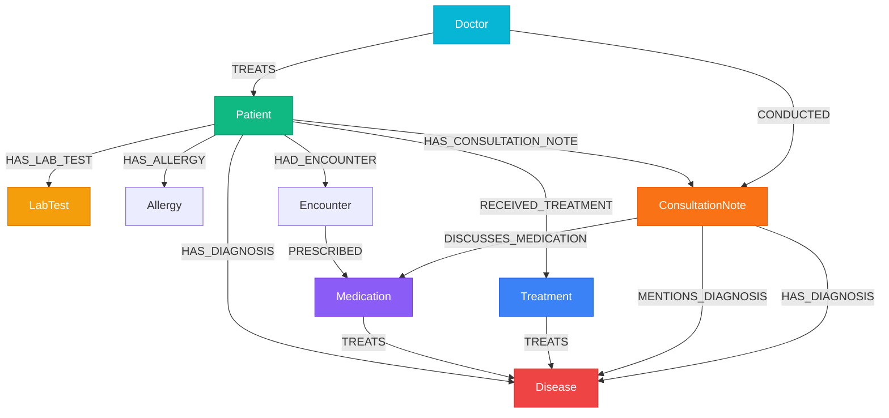

# MediGraph

<div align="center">

**Next-Generation Clinical Knowledge Graph & Privacy-First AI Medical Scribe**

*Transforming doctor-patient consultations into structured, validated EHR intelligence grounded in a real-time Neo4j AuraDB healthcare graph with 100% on-device edge transcription and deterministic physiological reasoning.*

[](https://react.dev/)
[](https://flask.palletsprojects.com/)
[](https://neo4j.com/cloud/platform/aura-graph-database/)
[-7952b3.svg?style=flat-square)](https://github.com/moonshine-ai/moonshine)
[-f55036.svg?style=flat-square)](https://groq.com/)
[](#2-mandatory-hipaa-safe-harbor-phi-de-identification)
[](#3-clinical-medication-safety--10x-dosage-audit-engine)
[-blue.svg?style=flat-square)](#7-role-based-access-control-rbac--offline-resilience)
[-46e3b7.svg?style=flat-square&logo=render)](https://render.com/)
[](LICENSE)

[Live Application](https://medigraph-frontend.onrender.com) • [Backend API](https://medigraph-backend.onrender.com) • [API Health Status](https://medigraph-backend.onrender.com/api/health) • [Cloud Deployment Guide](Docs/DEPLOYMENT.md)

</div>

---

## 🌐 Live Cloud Deployment & Demo Access

MediGraph is continuously deployed on Render Cloud connected to a live Neo4j AuraDB Enterprise graph cluster:

* **Frontend Web Application**: [https://medigraph-frontend.onrender.com](https://medigraph-frontend.onrender.com)
* **Backend REST API**: [https://medigraph-backend.onrender.com](https://medigraph-backend.onrender.com)
* **System Health & DB Ping**: [https://medigraph-backend.onrender.com/api/health](https://medigraph-backend.onrender.com/api/health)

### 🔑 Pre-Seeded Demo Credentials

The platform enforces strict **Role-Based Access Control (RBAC)** with JWT security tokens. You can immediately evaluate any role using these pre-seeded demo accounts:

| Role | Username / Identifier | Password | Access Boundaries |
| :--- | :--- | :--- | :--- |
| **Administrator** | `admin` | `AdminPassword123!` | **Full Access**: Patient Records, Scribe, Admin Neo4j Console (raw Cypher, schema inspection, latency monitor), User Role Management, Graph Explorer. |
| **Physician (Doctor)** | `dr.smith` | `DoctorPassword123!` | **Clinical Operations**: Patient Directory, Dossier & EHR, On-Device Scribe, Prescription & Note Generation, Medication Safety Audits, Treatment Intelligence, Clinical Chatbot. |
| **Clinical Researcher** | `researcher` | `ResearcherPassword123!` | **Population Intelligence**: Curated Graph Explorer presets, Disease Sectors, Multimodal Phenotype Vector Space, Treatment Analytics, Clinical Chatbot. *Admin console & raw Cypher restricted.* |

> [!TIP]
> Registration is open via `/register` and automatically creates a `researcher` account. Role elevation is managed securely by administrators via the `/api/auth/users/<id>/role` endpoint.

---

## 📑 Table of Contents

- [Why MediGraph?](#why-medigraph)
- [System Architecture](#system-architecture)
- [Core Technological Innovations](#core-technological-innovations)
  - [1. On-Device Edge AI Scribe](#1-on-device-edge-ai-scribe-100-private-streaming)
  - [2. Mandatory HIPAA Safe Harbor De-Identification](#2-mandatory-hipaa-safe-harbor-phi-de-identification)
  - [3. Clinical Medication Safety & 10x Dosage Audit Engine](#3-clinical-medication-safety--10x-dosage-audit-engine)
  - [4. Multimodal Phenotype Vector Space & Treatment Intelligence](#4-multimodal-phenotype-vector-space--treatment-intelligence)
  - [5. Knowledge Graph Grounded Chatbot RAG](#5-knowledge-graph-grounded-chatbot-rag)
  - [6. Force-Directed Visualization & Neo4j Admin Console](#6-force-directed-visualization--neo4j-admin-console)
  - [7. Role-Based Access Control & Offline Resilience](#7-role-based-access-control-rbac--offline-resilience)
- [Knowledge Graph Schema](#knowledge-graph-schema)
- [Interactive Application Pages](#interactive-application-pages)
- [Tech Stack](#tech-stack)
- [Local Development Setup](#local-development-setup)
- [Environment Variables](#environment-variables)
- [Project Directory Structure](#project-directory-structure)
- [Deployment](#deployment)
- [License](#license)

---

## 💡 Why MediGraph?

Traditional Electronic Health Record (EHR) systems trap clinical consultations in unstructured text notes, PDF attachments, and disconnected relational tables. Physicians spend up to **two hours on administrative documentation for every hour of direct patient care**, while critical longitudinal insights—such as drug-disease interactions, biomarker trajectory control, and cross-patient treatment efficacy—remain completely inaccessible.

**MediGraph fundamentally solves this crisis through three core pillars:**

1. **Zero-Egress Edge Transcription**: Consultations are transcribed **100% locally in the physician's browser** using high-precision WebAssembly models (**Moonshine Medium Streaming 245M** and **Browser Whisper**). Zero audio bytes are transmitted over the wire, guaranteeing absolute acoustic confidentiality.
2. **Clinical Safety & Gateways**: Before any LLM touches the transcript, a deterministic **HIPAA Safe Harbor PHI Gateway** sanitizes all personal identifiers. After extraction, an **ISMP-compliant Medication Safety Engine** audits dosages against therapeutic boundaries, preventing deadly 10-fold speech-recognition multiplier errors (e.g. 50mg vs 5mg) and Look-Alike Sound-Alike (SALAD) drug substitutions.
3. **Graph-Grounded Intelligence**: Extracted diagnoses, medications, procedures, and lab findings are linked into a **Neo4j AuraDB Knowledge Graph**. Patients are projected into a **Multimodal Phenotype Vector Space** weighted by **Inverse Patient Frequency (IDF)**, unlocking mathematical cohort similarity, biomarker control rates, and deterministic treatment ranking without LLM hallucination.

---

## 🏗️ System Architecture

```
┌────────────────────────────────────────────────────────────────────────────────────────────────────────┐
│                                   CLIENT DEVICE / BROWSER (React 19 + Vite)                            │
│                                                                                                        │
│   [ Doctor-Patient Consultation Microphone Input ]                                                    │
│                           │                                                                            │
│                           ▼                                                                            │
│   ┌────────────────────────────────────────────────────────┐   ┌───────────────────────────────────┐  │
│   │        100% In-Browser Edge Audio Transcription        │   │   Interactive Clinical Frontend   │  │
│   │  • Moonshine Medium Streaming (245M WASM Multithread)  │   │  • Vis.js & Cytoscape Graph Views │  │
│   │  • Browser Whisper Tiny (Transformers.js Fallback)     │   │  • Multi-Hot Vector Comparator    │  │
│   │  • CAVA-Inspired Real-Time Audio Level Visualizer      │   │  • Neo4j Browser Replica Console  │  │
│   └───────────────────────┬────────────────────────────────┘   └─────────────────▲─────────────────┘  │
│                           │ (Acoustic data never leaves device)                  │                    │
│                           ▼                                                      │                    │
│   ┌────────────────────────────────────────────────────────┐                     │                    │
│   │       Doctor Verification & Interactive Transcript     │                     │                    │
│   │  • Human-in-the-Loop review eliminates compounding     │                     │                    │
│   │  • Live multilingual translation (Spanish, Hindi, etc.)│                     │                    │
│   └───────────────────────┬────────────────────────────────┘                     │                    │
└───────────────────────────┼──────────────────────────────────────────────────────┼────────────────────┘
                            │ Clean text transcript only (HTTPS + Bearer JWT)      │
┌───────────────────────────┼──────────────────────────────────────────────────────┼────────────────────┐
│                           ▼                                                      │                    │
│                    BACKEND SERVICES & CLINICAL ENGINES (Python 3.11 / Flask)     │                    │
│                                                                                  │                    │
│   ┌───────────────────────────────────────────────────────────────────────────┐  │                    │
│   │ 🛡️ Local HIPAA Safe Harbor De-ID Gateway (scribe/privacy.py)               │  │                    │
│   │ Strips Name, MRN, DOB, Phone, Email, Location -> [PATIENT_SUBJECT] tokens │  │                    │
│   └─────────────────────────────────────┬─────────────────────────────────────┘  │                    │
│                                         │ Sanitized text (Zero PHI egress)       │                    │
│                                         ▼                                        │                    │
│   ┌───────────────────────────────────────────────────────────────────────────┐  │                    │
│   │ ⚡ Structured SOAP Extraction Engine (Groq Cloud openai/gpt-oss-120b)     │  │                    │
│   │ Clinical Summary • Diagnoses • Action Items • Discussed Pharmacotherapies │  │                    │
│   └─────────────────────────────────────┬─────────────────────────────────────┘  │                    │
│                                         │ Extracted Clinical Entities            │                    │
│                                         ▼                                        │                    │
│   ┌───────────────────────────────────────────────────────────────────────────┐  │                    │
│   │ 💊 Clinical Safety & 10x Dosage Audit Engine (scribe/safety.py)           │  │                    │
│   │ Catches 10x Multiplier Errors • Therapeutic Range Checks • ISMP SALAD     │  │                    │
│   └─────────────────────────────────────┬─────────────────────────────────────┘  │                    │
│                                         │ Verified Structured Entities           │                    │
│                                         ▼                                        │                    │
│   ┌───────────────────────────────────────────────────────────────────────────┐  │                    │
│   │ 🧬 Multimodal Phenotype Vector Space Engine (treatment_intel.py)          │──┘                    │
│   │ TF-IDF Specificity Weights • Cosine Similarity • Biomarker Control Rates  │                       │
│   └─────────────────────────────────────┬─────────────────────────────────────┘                       │
└─────────────────────────────────────────┼─────────────────────────────────────────────────────────────┘
                                          │ bolt+s / TLS 1.3 (Connection Pooling)
                                          ▼
┌────────────────────────────────────────────────────────────────────────────────────────────────────────┐
│                              NEO4J AURADB ENTERPRISE KNOWLEDGE GRAPH CLUSTER                           │
│                                                                                                        │
│   (:Patient)-[:HAS_DIAGNOSIS]->(:Disease)              (:Medication)-[:TREATS]->(:Disease)             │
│   (:Patient)-[:HAS_CONSULTATION_NOTE]->(:Note)         (:Patient)-[:HAS_LAB_TEST]->(:LabTest)          │
│   (:Note)-[:MENTIONS_DIAGNOSIS]->(:Disease)            (:Patient)-[:RECEIVED_TREATMENT]->(:Treatment)  │
│   (:Note)-[:DISCUSSES_MEDICATION]->(:Medication)       (:Doctor)-[:CONDUCTED]->(:ConsultationNote)     │
│   (:User {username, role, password_hash})              (:Allergy), (:Encounter), (:Observation)        │
└────────────────────────────────────────────────────────────────────────────────────────────────────────┘
```

---

## 🔬 Core Technological Innovations

### 1. On-Device Edge AI Scribe (100% Private Streaming)

Traditional medical scribes stream sensitive doctor-patient audio to third-party cloud transcription providers, introducing severe latency, high per-minute costs, and compliance risks. 

MediGraph executes the complete transcription pipeline directly inside the physician's browser:
* **Moonshine Medium Streaming (`@moonshine-ai/moonshine-wasm`)**: A state-of-the-art ~245M parameter transformer architecture running via WebAssembly multithreading (utilizing `SharedArrayBuffer` enabled by `Cross-Origin-Opener-Policy: same-origin` and `Cross-Origin-Embedder-Policy: require-corp` headers).
* **Self-Hosted Offline Weights**: Model files (`encoder.ort`, `decoder_kv.ort`, `cross_kv.ort`, `adapter.ort`, `frontend.ort`, `tokenizer.bin`) reside in `frontend/public/models/moonshine/`, enabling complete offline execution without CDN roundtrips.
* **Browser Whisper Tiny Fallback (`@huggingface/transformers`)**: Client-side Whisper pipeline utilizing Web Audio API resampling (16 kHz mono `Float32Array`) and browser Cache API / IndexedDB storage (~40 MB).
* **CAVA Audio Visualizer**: Custom SVG/Canvas dynamic equalizer confirming microphone gain, active voice input, and acoustic frequency distribution.
* **Manual Clinical Entry**: Guaranteed fallback workflow if microphone hardware is unavailable.

---

### 2. Mandatory HIPAA Safe Harbor PHI De-Identification

MediGraph strictly enforces local de-identification before any prompt or transcript reaches external LLM inference (`scribe/privacy.py` and `backend/chat_privacy.py`):
* **Deterministic Identifier Redaction**: Automatically detects and redacts 18 HIPAA Safe Harbor direct identifiers:
  * Patient and physician names (including multi-word given and surnames)
  * Medical Record Numbers (MRN) and Patient IDs
  * Telephone and Fax numbers (`_PHONE_REGEX`)
  * Email addresses (`_EMAIL_REGEX`)
  * Social Security Numbers (`_SSN_REGEX`)
  * Dates of Birth and explicit birth-year statements (`_DOB_REGEX`, `_BIRTH_YEAR_REGEX`)
  * Patient ages exceeding safe limits (`_AGE_REGEX`)
  * Street addresses, apartment numbers, and 5/9-digit ZIP codes (`_STREET_REGEX`, `_ZIP_REGEX`)
* **Reversible Pseudonymous Tokenization**: Replaces identifiers with synthetic semantic tags:
  ```text
  "Patient Johnathan Smith (MRN: 90218), born on 04/12/1978, presented to Dr. Sarah Davis..."
  ──► "[PATIENT_SUBJECT] (MRN: [REDACTED]), born on [DATE REDACTED], presented to [ATTENDING_PHYSICIAN]..."
  ```
* **Audit-Only Token Maps**: Token mappings are preserved in memory for session continuity and compliance auditing, but **never** transmitted to LLM providers.

---

### 3. Clinical Medication Safety & 10x Dosage Audit Engine

Speech recognition models frequently mishear numerical values and drug names—errors that can be fatal in clinical practice. MediGraph's safety engine (`scribe/safety.py`) intercepts every extracted prescription before it can be committed to the EHR:
* **10-Fold Dosage Multiplier Detection**: Automatically calculates standard adult therapeutic boundaries and catches 10x multiplier errors (e.g., transcribing `50 mg` instead of `5 mg` for Lisinopril or Amlodipine, or `100 mg` instead of `10 mg` for Atorvastatin).
* **Therapeutic Range & Tablet Strength Verification**: Evaluates single dose, maximum daily dose, unit integrity (e.g., flagging dangerous `g` vs. `mg` or `mg` vs. `mcg` confusions on Levothyroxine), and approved commercial tablet strengths.
* **ISMP Look-Alike Sound-Alike (SALAD) Protection**: Integrates Institute for Safe Medication Practices guidelines to catch phonetically similar drug substitutions:
  * *Hydralazine* (antihypertensive vasodilator) $\leftrightarrow$ *Hydroxyzine* (antihistamine/sedative)
  * *Clonidine* (alpha-2 agonist) $\leftrightarrow$ *Klonopin / Clonazepam* (benzodiazepine)
  * *Celebrex* (NSAID) $\leftrightarrow$ *Celexa* (SSRI antidepressant)
  * *Metformin* (biguanide) $\leftrightarrow$ *Metronidazole* (nitroimidazole antibiotic)
* **Real-Time Endpoint**: Available both during batch note extraction and as an interactive physician verification endpoint (`POST /api/scribe/audit-medication`).

---

### 4. Multimodal Phenotype Vector Space & Treatment Intelligence

Rather than relying on opaque LLM recommendations, MediGraph implements a **100% deterministic, mathematically verifiable clinical intelligence engine** (`backend/analysis/treatment_intel.py`):

#### A. Clinical Inverse Patient Frequency (IDF) Weighting
Rare, high-specificity conditions and critical pharmacotherapies receive significantly higher weights than ubiquitous baseline findings:

$$\text{IDF}(t) = \ln\left(1 + \frac{N}{1 + \text{DF}(t)}\right)$$

Where $N$ is the total population cohort and $\text{DF}(t)$ is the patient frequency of term $t$. Normalized weights $w \in [0.15, 1.00]$ ensure that conditions like *Diabetic Nephropathy* ($w \approx 0.92$) or *Chemotherapy* ($w \approx 0.95$) dominate similarity calculations over baseline entries like *Routine Checkup* ($w \approx 0.18$).

#### B. Weighted Phenotype Cosine Similarity
Calculates true clinical vector similarity across both condition and medication feature dimensions:

$$\text{Sim}(\vec{u}, \vec{v}) = \frac{\sum_{i} w_i^2 \cdot u_i \cdot v_i}{\sqrt{\sum_{i} (w_i \cdot u_i)^2} \cdot \sqrt{\sum_{i} (w_i \cdot v_i)^2}}$$

#### C. Interactive Multi-Hot Vector Comparator
Physicians and researchers can open any patient match and inspect a live, bit-by-bit vector projection:
* Full dimension alignment across active disease and drug vocabularies.
* Target vector bit $v_{\text{tgt}} \in \{0, 1\}$ vs. Candidate vector bit $v_{\text{match}} \in \{0, 1\}$.
* Live mathematical breakdown showing dot-product terms, norm scalars, and final percentage similarity.

#### D. Physiological Biomarker Control Scoring
Evaluates actual clinical efficacy by checking whether patients on a given regimen achieve standardized clinical control:
* **Type 2 Diabetes / Prediabetes**: Fasting Glucose $\le 125\text{ mg/dL}$ and $\text{HbA1c} \le 7.0\%$.
* **Essential Hypertension**: Systolic Blood Pressure $< 130\text{ mmHg}$ and Diastolic Blood Pressure $< 80\text{ mmHg}$.
* **Anemia**: Hemoglobin $\ge 12.0\text{ g/dL}$ and Hematocrit $\ge 36.0\%$.
* **Obesity**: Body Mass Index (BMI) $< 30.0\text{ kg/m}^2$.
* **Line of Therapy (LoT)**: Categorizes protocols into 1st Line (primary guideline standards) vs. 2nd/3rd Line with recovery rate % and patient evidence volume.

---

### 5. Knowledge Graph Grounded Chatbot RAG

MediGraph's Clinical Assistant (`backend/routes/chat.py`) bridges natural-language clinical queries directly with the graph database:
* **Damerau-Levenshtein Entity Resolution**: Robust typo-tolerant patient identification matches misspelled names or partial tokens (e.g. *"Angel"* $\leftrightarrow$ *"Angelina"*, *"Jhon"* $\leftrightarrow$ *"John"*) and resolves UUIDs directly.
* **Dynamic Cypher Query Generation**: Introspects live database schema (`fetch_cypher_schema`) and dynamically constructs multi-hop traversals for complex questions.
* **Dual-Context Awareness**: Automatically identifies whether the user is asking about an individual patient dossier or a broader population cohort.
* **Pre-Prompt HIPAA Sanitization**: De-identifies patient profiles before injecting them into Groq Cloud (`openai/gpt-oss-120b`).
* **Dynamic Clinical Suggestions**: Generates patient-tailored prompt pills based on active diagnoses and abnormal vitals.

---

### 6. Force-Directed Visualization & Neo4j Admin Console

* **Vis.js Network Force Physics (`VisNetworkCanvas.tsx`)**: High-performance canvas rendering with Barnes-Hut gravitational repulsion, collision stabilization, smooth pan/zoom, fullscreen toggle, and physics stabilization controls.
* **Cytoscape Feature Graphs (`LazyFeatureGraph.tsx`)**: Lightweight vector and sub-graph feature graph overlays.
* **Responsive Node Properties Inspector (`NodePropertiesSidebar.tsx`)**: Click any entity across the graph to slide open an inspector displaying metadata, clinical attributes, timestamps, and immediate edge relationships.
* **Clinical Color Taxonomy**: Standardized visual entity palette:
  * 🟢 **Patient**: `#10b981` (Emerald)
  * 🔴 **Disease**: `#ef4444` (Rose)
  * 🟣 **Medication**: `#8b5cf6` (Violet)
  * 🔵 **Treatment / Procedure**: `#3b82f6` (Blue)
  * 🟡 **Lab Test / Observation**: `#f59e0b` (Amber)
  * 🟠 **Consultation Note**: `#f97316` (Orange)
  * 🩺 **Doctor / Provider**: `#06b6d4` (Cyan)
* **Neo4j Browser Replica Admin Console (`AdminGraphPanel.tsx`)**:
  * Real-time AuraDB connection status and live millisecond latency ping.
  * Interactive Cypher query console (`neo4j$` prompt) with bookmarking and schema explorer.
  * Multi-tab results viewer: **Graph Canvas**, **Data Table**, and **Raw JSON**.
  * Persistent Query History stored in browser `localStorage`.
  * One-click CSV and JSON data export.

---

### 7. Role-Based Access Control (RBAC) & Offline Resilience

* **JWT Architecture (`backend/auth_utils.py`)**: Stateless HMAC-SHA256 tokens (`PyJWT`) with configurable expiration (`JWT_EXPIRATION_MINUTES`). Password hashing powered by Werkzeug PBKDF2 with SHA-256 salts.
* **Decorated Route Protection**:
  * `@require_auth`: Protects standard clinical views.
  * `@require_role("admin", "doctor")`: Restricts clinical note creation, Scribe execution, and safety audits.
  * `@require_role("admin")`: Restricts raw Cypher execution, patient deletion, and role administration.
* **Offline User Mirroring (`backend/user_store.py`)**: When running in offline or disconnected clinical environments (e.g. mobile clinics, isolated workstations), user credentials mirror to a secure local cache (`backend/user_cache.json`). The on-device Scribe and local features remain completely operational even if cloud AuraDB is temporarily unreachable.

---

## 📊 Knowledge Graph Schema

MediGraph organizes healthcare data as a rich, multi-relational property graph in Neo4j:



### Primary Node Labels & Properties

| Label | Primary Keys & Clinical Properties |
| :--- | :--- |
| `:Patient` | `id`, `first_name`, `last_name`, `gender`, `date_of_birth`, `address`, `city`, `income`, `insurance_provider` |
| `:Disease` | `name`, `code` (SNOMED-CT / ICD-10) |
| `:Medication` | `name`, `code` (RxNorm), `category`, `dosage_form`, `strength`, `cost`, `indication` |
| `:Treatment` | `id`, `treatment_type`, `description`, `cost`, `treatment_date`, `outcome`, `success` |
| `:LabTest` | `id`, `name` (LOINC), `result`, `unit`, `reference_range`, `status` (*Normal* vs *Abnormal*), `date` |
| `:ConsultationNote` | `id`, `title`, `summary`, `diagnoses` (list), `action_items` (list), `medications_discussed` (list), `created_at`, `source` |
| `:Doctor` | `id`, `name`, `first_name`, `last_name`, `specialization`, `years_experience`, `hospital_branch`, `email` |
| `:User` | `id`, `username`, `email`, `role` (*admin*, *doctor*, *researcher*), `active`, `created_at` |

---

## 🖥️ Interactive Application Pages

| Route | Page Title | Role Access | Key Capabilities |
| :--- | :--- | :--- | :--- |
| `/login` | **Sign In** | Public | Secure JWT credential authentication with quick-fill demo buttons. |
| `/` | **Dashboard** | Authenticated | Clinical KPIs, 18-month treatment activity trend SVG, recent consultations feed, disease cohort overview. |
| `/patients` | **Patient Directory** | Authenticated | Searchable patient registry with demographics, contact cards, and active diagnoses badges. |
| `/patients/:id` | **Patient Dossier** | Authenticated | Comprehensive EHR dossier, embedded **On-Device Scribe Widget**, Vis.js sub-graph, and similar patient cohort list. |
| `/treatment-intelligence` | **Treatment Intelligence** | Authenticated | Population-wide patient summaries with diagnosis counts, treatment records, and direct link to clinical vector analysis. |
| `/treatment-intelligence/:id` | **Patient Vector Intel** | Authenticated | **Multi-Hot Vector Comparator**, Inverse Patient Frequency specificity weights, cosine similarity proofs, and similar patient graphs. |
| `/sectors` | **Clinical Sectors** | Authenticated | Disease cohort directory with patient distributions and treatment protocols. |
| `/sectors/:id` | **Sector Intelligence** | Authenticated | Physiological biomarker control rate scoring, top indicated medications, procedures, and line-of-therapy breakdowns. |
| `/graph` | **Graph Explorer** | Admin, Researcher | Curated Cypher preset queries, interactive Vis.js canvas, and slide-out node property inspection. |
| `/admin/graph` | **Neo4j Admin Console** | Admin Only | Full Neo4j Browser replica with Cypher prompt, query history, live latency ping, schema inspector, and CSV/JSON export. |
| `/chatbot` | **Clinical Assistant** | Authenticated | Graph-grounded conversational RAG, automatic patient/cohort entity linking, dynamic prompt suggestions. |

---

## 💻 Tech Stack

### Frontend Architecture
* **Core Framework**: React 19 (`react`, `react-dom`, `react-router-dom` v7)
* **Build Tooling**: Vite 8 with strict TypeScript (`typescript` ~6.0, `oxlint`)
* **On-Device Edge AI**:
  * `@moonshine-ai/moonshine-wasm` (Medium Streaming WebAssembly model)
  * `@huggingface/transformers` & `@xenova/transformers` (Browser Whisper Tiny)
* **Graph Visualization**:
  * `vis-network` (Force-directed physics simulation)
  * `cytoscape` & `@types/cytoscape` (Sub-graph feature graphs)
* **Data Visualization & Icons**: `recharts` v3, `lucide-react`
* **Styling & Theming**: Pure CSS with Custom Design Tokens (`tokens.css`), responsive off-canvas mobile drawers, and Light/Dark themes.

### Backend & Analytics Engine
* **Runtime**: Python 3.11
* **API Framework**: Flask 3.1, `flask-cors` 5.x, Gunicorn WSGI
* **Security & Auth**: `PyJWT` (HMAC-SHA256), `werkzeug.security` (PBKDF2 SHA-256)
* **Graph Database**: `neo4j` 5.x Python Driver (Bolt+s protocol with TLS 1.3 connection pooling)
* **Clinical Intelligence**:
  * `scribe/privacy.py`: Deterministic HIPAA Safe Harbor regex PHI sanitizer
  * `scribe/safety.py`: 10-fold dosage multiplier and ISMP SALAD error engine
  * `backend/analysis/treatment_intel.py`: Pure-Python Clinical IDF Vector Engine & Physiological Threshold Scorer
* **LLM Engine**: Groq Cloud SDK / REST (`openai/gpt-oss-120b`) for structured SOAP extraction and chatbot RAG.

---

## 🚀 Local Development Setup

### Prerequisites
* **Node.js** (v18.0 or higher) & **npm**
* **Python** (v3.10 or v3.11)
* **Active Neo4j Database** (Neo4j AuraDB Cloud free instance or local Neo4j Desktop)
* **Groq Cloud API Key** (from [console.groq.com](https://console.groq.com))

### 1. Clone the Repository
```bash
git clone https://github.com/ParasuramK227/Medigraph.git
cd Medigraph
```

### 2. Configure Environment Variables
Copy `.env.example` to `.env` in the root directory:
```bash
cp .env.example .env
```

Configure your credentials:
```env
NEO4J_URI=neo4j+s://<your-auradb-id>.databases.neo4j.io
NEO4J_USER=neo4j
NEO4J_PASSWORD=<your-auradb-password>

GROQ_API_KEY=<your-groq-api-key>

JWT_SECRET_KEY=at-least-32-characters-random-secret-key-for-jwt-signing
JWT_EXPIRATION_MINUTES=480

CORS_ORIGINS=http://localhost:5173,http://localhost:3000
```

### 3. Setup and Run the Python Backend
```bash
# Create virtual environment
python -m venv .venv

# Activate virtual environment
# On Linux/macOS:
source .venv/bin/activate
# On Windows (PowerShell):
.venv\Scripts\Activate.ps1

# Install dependencies
pip install -r requirements.txt

# Start Flask backend server
python -m backend.app
# Backend API runs at http://localhost:5000
```

### 4. Setup and Run the Frontend
In a separate terminal:
```bash
cd frontend

# Install npm dependencies
npm install

# (Optional) Pre-download Moonshine model weights for offline execution:
python ../scripts/download_moonshine.py

# Start Vite development server
npm run dev
# Frontend runs at http://localhost:5173
```

Open [http://localhost:5173](http://localhost:5173) and sign in using `admin` / `AdminPassword123!` or `dr.smith` / `DoctorPassword123!`.

---

## ⚙️ Environment Variables

| Variable | Required | Default | Purpose |
| :--- | :---: | :---: | :--- |
| `NEO4J_URI` | **Yes** | — | Neo4j AuraDB Bolt connection URI (`neo4j+s://...`). |
| `NEO4J_USER` | **Yes** | `neo4j` | Database username. |
| `NEO4J_PASSWORD` | **Yes** | — | Database password. |
| `GROQ_API_KEY` | **Yes** | — | API key for Groq Cloud LLM (`openai/gpt-oss-120b`). |
| `JWT_SECRET_KEY` | **Recommended** | Dev fallback | Secret key for signing HMAC-SHA256 JWT tokens ($\ge 32$ chars in production). |
| `JWT_EXPIRATION_MINUTES` | No | `60` | Duration in minutes before access token expires. |
| `USER_CACHE_PATH` | No | `backend/user_cache.json` | Path to the local JSON user cache for offline resilience. |
| `CORS_ORIGINS` | No | `*` | Allowed CORS origins for API endpoints. |
| `VITE_API_BASE` | No | `http://localhost:5000` | Target backend URL for frontend (set automatically on Render). |

---

## 📁 Project Directory Structure

```
Medigraph/
├── backend/                              # Python Flask API & Clinical Analytics
│   ├── analysis/                         # Pure-Python Clinical Intelligence
│   │   ├── graph_fetch.py                # Graph queries for patients, diseases & treatments
│   │   └── treatment_intel.py            # Multimodal IDF Vector Engine & Biomarker Scoring
│   ├── routes/                           # Modular API Blueprints
│   │   ├── auth.py                       # /api/auth — Login, register, me, user management
│   │   ├── chat.py                       # /api/chat — Graph-grounded clinical chatbot RAG
│   │   ├── graph.py                      # /api/graph — Cypher passthrough, presets, patients
│   │   └── scribe.py                     # /api/scribe — Translation, extraction, safety audit
│   ├── scripts/                          # Seeder Scripts
│   │   ├── seed.py                       # Standard CSV seeder
│   │   └── synthea_seeder.py             # Synthea clinical seeder
│   ├── app.py                            # Flask application factory & health check
│   ├── auth_utils.py                     # JWT token management & RBAC decorators
│   ├── chat_privacy.py                   # Chatbot profile PHI de-identification
│   ├── neo4j_connection.py               # Thread-safe Neo4j driver connection pool
│   ├── user_cache.json                   # Offline mirrored user cache
│   └── user_store.py                     # Neo4j user persistence & demo bootstrap
├── frontend/                             # React 19 + Vite + TypeScript Application
│   ├── public/
│   │   ├── fonts/                        # Departure Mono & custom typography
│   │   └── models/moonshine/             # Self-hosted Moonshine WASM model weights
│   ├── src/
│   │   ├── components/
│   │   │   ├── admin/                    # AdminGraphPanel (Neo4j Browser replica)
│   │   │   ├── auth/                     # ProtectedRoute & Role Guards
│   │   │   ├── chat/                     # Clinical Chatbot Floating Widget & Panel
│   │   │   ├── feature/                  # LazyFeatureGraph (Cytoscape)
│   │   │   ├── graph/                    # VisNetworkCanvas & NodePropertiesSidebar
│   │   │   ├── layout/                   # AppLayout, SideNav, TopBar, ThemeToggle
│   │   │   └── scribe/                   # ScribeWidget & CAVA Audio Visualizer
│   │   ├── context/                      # AuthContext (session, login, register)
│   │   ├── lib/                          # API Client, browserMoonshine, browserWhisper
│   │   ├── pages/                        # Dashboard, Patients, Sectors, Intel, Admin
│   │   ├── styles/                       # CSS design tokens, typography, themes
│   │   └── App.tsx                       # Main router & RBAC route map
│   ├── package.json                      # Frontend dependencies
│   └── vite.config.ts                    # Vite config with COOP/COEP isolation headers
├── scribe/                               # Speech-to-Text & Clinical Note Pipeline
│   ├── prompts/                          # Versioned LLM extraction schemas
│   │   └── scribe_extraction.md          # Grounded SOAP extraction prompt
│   ├── extraction.py                     # Groq LLM clinical extraction
│   ├── privacy.py                        # Deterministic HIPAA Safe Harbor PHI Redactor
│   ├── safety.py                         # 10x dosage error & ISMP SALAD audit engine
│   ├── session.py                        # In-memory consultation session manager
│   └── transcription.py                  # Real-time multilingual translation
├── scripts/
│   └── download_moonshine.py             # Moonshine WASM model weights downloader
├── Docs/                                 # Technical Documentation & Deployment Guides
│   ├── DEPLOYMENT.md                     # Render Cloud deployment instructions
│   ├── README.md                         # Documentation index
│   ├── backend.md                        # Backend API reference
│   ├── frontend.md                       # Frontend architecture guide
│   └── scribe.md                         # Clinical scribe pipeline reference
├── .env.example                          # Example environment configuration
├── render.yaml                           # Render 1-click cloud blueprint
├── requirements.txt                      # Root Python dependencies
└── README.md                             # Master repository documentation
```

---

## ☁️ Deployment

MediGraph is production-ready for 1-click deployment on [Render](https://render.com) using the included [`render.yaml`](render.yaml) blueprint:

1. Connect your GitHub repository on [dashboard.render.com](https://dashboard.render.com).
2. Select **"New +"** $\to$ **"Blueprint"**.
3. Render automatically provisions:
   * **`medigraph-backend`**: Python 3.11 Gunicorn Web Service with automatic health checks.
   * **`medigraph-frontend`**: Static Site with global CDN, free SSL, and mandatory `COOP`/`COEP` headers for WebAssembly multithreading.
4. Supply your secret environment variables (`NEO4J_URI`, `NEO4J_PASSWORD`, `GROQ_API_KEY`, `JWT_SECRET_KEY`).

See [`Docs/DEPLOYMENT.md`](Docs/DEPLOYMENT.md) for complete step-by-step instructions and troubleshooting.

---

## 📄 License

This project is licensed under the **MIT License** — see the [LICENSE](LICENSE) file for details.\n